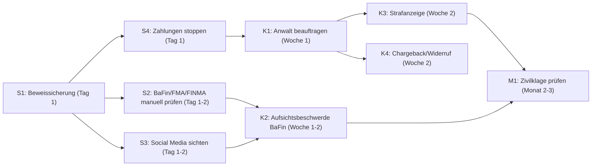

# Umsetzungsplan: Diamond Solution Dubai

## Zusammenfassung

Die Ermittlung vom 18.03.2026 hat ergeben, dass "Diamond Solution" (diamond-solution.net) eine nicht-lizenzierte Krypto-Investment-Plattform mit Sitz angeblich in Dubai betreibt. 7 kritische Red Flags identifiziert (ScamAdviser Score 0/100, keine DFSA/DIFC-Lizenz, Login-only mit Bitcoin-Keywords, WHOIS versteckt, 6 Monate alte Domain). Top-Risiko: Falls bereits Gelder eingezahlt wurden, droht Totalverlust. Dringendste Aktion: Beweissicherung HEUTE — Webseiten und Social-Media-Profile können jederzeit gelöscht werden.

⏰ **Nächste kritische Frist**: HEUTE (19.03.2026) — Beweissicherung vor möglicher Löschung
💰 **Geschätzte Gesamtkosten**: 0–250€ (Sofort-Maßnahmen kostenlos, Anwalt-Erstberatung optional)
📊 **Basis-Konfidenz**: 75% (B) — basiert auf 8+ unabhängigen Quellen

---

## Bereits erledigt

| # | Maßnahme | Erledigt am | Ergebnis |
|---|---------|------------|---------|
| E1 | OSINT-Ermittlung durchgeführt | 18.03.2026 | 12 Red Flags identifiziert, Bewertung D |
| E2 | Regulatorik-Check (SEC, ESMA, DFSA, DIFC, FCA) | 18.03.2026 | Keine Lizenz, keine Warnung |
| E3 | Register-Recherche (DE, UK, UAE) | 18.03.2026 | Kein Registereintrag |

---

## Abhängigkeits-Sequenz

---

## 🔴 Sofort-Maßnahmen (0–7 Tage)

| # | Was | Warum | Wer | Bis wann | Womit | Kosten | Erfolgskriterium |
|---|-----|-------|-----|----------|-------|--------|-----------------|
| S1 | Screenshots und Volltext-Archivierung aller Webseiten und Social-Media-Profile von Diamond Solution sichern | Betreiber können Webseite und Profile jederzeit löschen — dann sind Beweise weg | User selbst | 19.03.2026 (HEUTE) | Wayback Machine: https://web.archive.org/save/diamond-solution.net — Screenshots: Browser-Extension "Full Page Screenshot" — Social Media: https://facebook.com/diamondsolutiondubai, https://instagram.com/diamondsolutiondubai, https://t.me/diamondsolutiondubai, https://tiktok.com/@diamondsolutiondubai | 0€ | Screenshots aller 5 Plattformen als PNG/PDF gespeichert, Wayback-Archivierung bestätigt |
| S2 | BaFin-, FMA- und FINMA-Warnlisten manuell im Browser prüfen | Automatisierte Abfragen wurden durch Cloudflare blockiert — manuelle Prüfung nötig | User selbst | 20.03.2026 | BaFin: https://www.bafin.de/DE/Verbraucher/Warnungen — FMA: https://www.fma.gv.at/en/warnings/ — FINMA: https://www.finma.ch/en/finma-public/authorisation-and-reporting/warning-list/ | 0€ | Für jede Behörde dokumentiert: Treffer Ja/Nein mit Screenshot |
| S3 | Social-Media-Profile von @diamondsolutiondubai öffnen und Inhalte dokumentieren | Profile existieren (Facebook, Instagram, TikTok, Telegram) aber Inhalte konnten automatisiert nicht ausgelesen werden — manuell Werbeclaims, Renditeversprechen, Kommentare dokumentieren | User selbst | 21.03.2026 | Facebook, Instagram, TikTok, Telegram (Links siehe S1) — Auf Renditeversprechen, Testimonials und Kommentare von Geschädigten achten | 0€ | Inhalt aller 4 Profile dokumentiert (Screenshots + Textnotizen) |
| S4 | Falls bereits Gelder an Diamond Solution überwiesen: Sofort ALLE weiteren Zahlungen einstellen und Bank über Betrugsverdacht informieren | Jede weitere Zahlung erhöht den Schaden. Banken können unter Umständen Zahlungen zurückrufen (Recall) wenn innerhalb weniger Tage gemeldet | User selbst | 19.03.2026 (HEUTE) | Anruf bei der Hausbank, Stichwort "Betrugsverdacht, Zahlungsrecall prüfen". Bei Kreditkarte: Karte sperren lassen | 0€ | Bank informiert, laufende Zahlungen gestoppt, Recall angefragt |

**Status-Übersicht Sofort:**
| # | Status |
|---|--------|
| S1 | ✗ Nicht begonnen |
| S2 | ✗ Nicht begonnen |
| S3 | ✗ Nicht begonnen |
| S4 | ✗ Nicht begonnen |

---

## 🟡 Kurzfristige Maßnahmen (8–30 Tage)

| # | Was | Warum | Wer | Bis wann | Womit | Kosten | Erfolgskriterium |
|---|-----|-------|-----|----------|-------|--------|-----------------|
| K1 | Fachanwalt für Kapitalmarktrecht oder IT-Recht mit Erfahrung bei Krypto-Betrug beauftragen | Professionelle Einschätzung der Erfolgsaussichten, Koordination der rechtlichen Schritte, Vertretung gegenüber Behörden | Fachanwalt Kapitalmarktrecht | Bis 28.03.2026 | Anwaltssuche: https://www.anwaltauskunft.de (Filter: Kapitalmarktrecht) oder https://www.anwalt.de (Filter: Kryptowährungen, Anlagebetrug). Erstberatung oft kostenlos oder nach RVG §34 max. 190€+MwSt | 0–250€ (Erstberatung) | Mandat erteilt, Anwalt hat Ermittlungsbericht erhalten |
| K2 | Aufsichtsbeschwerde bei BaFin einreichen: Diamond Solution bietet mutmaßlich unerlaubte Finanzdienstleistungen an | BaFin kann unerlaubte Geschäfte untersagen und die Plattform auf die Warnliste setzen. Kostenlos, parallel zu anderen Schritten möglich | User selbst (oder Anwalt) | Bis 01.04.2026 | Online-Formular: https://www.bafin.de/DE/Verbraucher/BeschschwVerbr/beschwverbrauch_node.html — Beizufügen: Screenshots von diamond-solution.net, Ermittlungsbericht, ggf. Zahlungsbelege | 0€ | Eingangsbestätigung der BaFin liegt vor |
| K3 | Strafanzeige bei der Staatsanwaltschaft oder Polizei erstatten wegen Verdacht auf Anlagebetrug (§ 264a StGB) und/oder Betrug (§ 263 StGB) | Strafverfolgung ermöglicht behördliche Ermittlungen mit Befugnissen die Privatpersonen nicht haben (Kontensperrung, internationale Rechtshilfe) | User selbst + Anwalt | Bis 05.04.2026 | Online-Anzeige je nach Bundesland: https://online-strafanzeige.de — oder persönlich bei nächster Polizeidienststelle. Beizufügen: Ermittlungsbericht, Screenshots, Zahlungsbelege | 0€ | Aktenzeichen der Staatsanwaltschaft erhalten |
| K4 | Falls Zahlung per Kreditkarte: Chargeback bei Kreditkartenunternehmen beantragen. Falls Überweisung: Rückbuchung bei Bank anfragen | Chargeback-Frist bei Kreditkarten: 120 Tage ab Zahlung. Bei Überweisung: Recall nur innerhalb weniger Tage möglich | User selbst | Bis 28.03.2026 | Kreditkarte: Anruf bei Kartenherausgeber, Stichwort "Chargeback, unauthorized transaction / fraud". SEPA: Anruf bei Bank, "SEPA-Recall" | 0€ | Chargeback-Antrag eingereicht / Recall-Anfrage gestellt |

**Status-Übersicht Kurzfristig:**
| # | Status |
|---|--------|
| K1 | ✗ Nicht begonnen |
| K2 | ✗ Nicht begonnen |
| K3 | ✗ Nicht begonnen |
| K4 | ✗ Nicht begonnen |

---

## 🟢 Mittelfristige Maßnahmen (31–90 Tage)

| # | Was | Warum | Wer | Bis wann | Womit | Kosten | Erfolgskriterium |
|---|-----|-------|-----|----------|-------|--------|-----------------|
| M1 | Zivilklage prüfen lassen — nur wenn Betreiber identifizierbar UND Vollstreckung realistisch | Zivilklage gegen unbekannte Offshore-Betreiber ist sinnlos. Erst prüfen: Wer ist der Betreiber? Wo hat er Vermögen? | Fachanwalt | Bis 15.06.2026 | Insolvenzbekanntmachungen: https://www.insolvenzbekanntmachungen.de — Bei Offshore/Dubai: Vollstreckung extrem schwierig, Kosten-Nutzen prüfen | 3.000–10.000€ (bei Klage) | Anwalt hat schriftliche Einschätzung zu Erfolgsaussichten und Kosten gegeben |
| M2 | Erfahrungsberichte und Geschädigte suchen — in Foren, Reddit, Telegram-Gruppen nach anderen Betroffenen recherchieren | Mehrere Geschädigte stärken die Beweislage und ermöglichen ggf. eine gemeinsame Strafanzeige oder Sammelklage | User selbst | Bis 30.04.2026 | Reddit: Suche "Diamond Solution" in r/scams, r/cryptocurrency — Trustpilot: https://www.trustpilot.com/review/diamond-solution.net — Google: "Diamond Solution Erfahrungen" / "Diamond Solution Betrug" | 0€ | Dokumentierte Liste von Geschädigten / Erfahrungsberichten |
| M3 | Wenn BaFin-Beschwerde eingereicht: Nachfassen nach 30 Tagen | BaFin-Verfahren können Wochen dauern. Nachfassen zeigt Dringlichkeit und liefert Status-Update | User selbst | Bis 01.05.2026 | E-Mail an BaFin-Verbraucherservice mit Aktenzeichen aus K2 | 0€ | Schriftliche Statusmeldung der BaFin erhalten |

---

## 🔵 Laufende Maßnahmen (regelmäßig)

| # | Was | Intervall | Wer | Womit |
|---|-----|-----------|-----|-------|
| L1 | diamond-solution.net auf Veränderungen prüfen (neue Domains, neuer Name, Offline-Gang) | Monatlich | User | https://web.archive.org/web/*/diamond-solution.net + direkter Aufruf |
| L2 | BaFin-Warnliste auf neuen Eintrag "Diamond Solution" prüfen | Monatlich | User | https://www.bafin.de/DE/Verbraucher/Warnungen |
| L3 | Google Alert einrichten für "Diamond Solution Dubai" + "diamond-solution.net" | Automatisch | User | https://www.google.com/alerts — E-Mail bei neuen Treffern |

---

## ⚡ Konflikt-Auflösungen

Keine Konflikte — Findings stammen aus einer Domäne (Recht). Klare Handlungssequenz ohne widersprüchliche Empfehlungen.

---

## 💰 Kosten-Übersicht

| Maßnahme | Geschätzte Kosten | Kostenträger | Rechtsschutz? |
|---------|------------------|-------------|--------------|
| S1-S4 Beweissicherung + Bank informieren | 0€ | User | — |
| K1 Anwalt Erstberatung | 0–250€ | User | Oft abgedeckt |
| K2 BaFin Aufsichtsbeschwerde | 0€ | User | — |
| K3 Strafanzeige | 0€ | User | — |
| K4 Chargeback/Recall | 0€ | User | — |
| M1 Zivilklage (falls sinnvoll) | 3.000–10.000€ | User | Prüfen — Kapitalanlagerecht oft abgedeckt |
| **Gesamt (Minimum)** | **0€** | | |
| **Gesamt (Maximum)** | **~10.500€** | | |

**Prozesskostenhilfe**: Prüfen — bei geringem Einkommen Antrag möglich
**Rechtsschutzversicherung**: Prüfen — Kapitalanlage-Rechtsschutz deckt oft Erstberatung und Strafanzeige ab

---

## 🔬 Devil's Advocate Check

- **Hauptgegenargument**: Es könnte sich um eine legitime, aber schlecht aufgestellte Firma handeln, die noch in der Aufbauphase ist (daher junge Domain, fehlendes Impressum)
- **Entkräftung**: 7 kritische Red Flags gleichzeitig (keine Lizenz + ScamAdviser 0 + versteckter Betreiber + Login-only + Bitcoin-Keywords) sind in Kombination statistisch nahezu ausschließlich bei betrügerischen Plattformen zu finden. Eine legitime Firma hätte mindestens eine Lizenz und ein Impressum.
- **Blind Spots**: Social-Media-Inhalte konnten nicht ausgelesen werden — dort könnten entlastende Informationen sein (z.B. echte Produktdemos). BaFin/FMA/FINMA konnten nicht automatisiert geprüft werden.
- **Gray Areas**: Ohne identifizierten Betreiber ist unklar ob deutsches Strafrecht anwendbar ist (Server steht in DE → § 9 StGB Handlungsort).
- **Plan-Konfidenz**: 80% — hohe Sicherheit bei Sofort- und Kurzfristmaßnahmen, Unsicherheit bei Zivilklage (Betreiber-Identifikation offen)

---

*Erstellt: 2026-03-19 | Plugin: beratungs-suite-pro v0.5.0 | Basis: 2026-03-18-diamond-solution-dubai-ermittlung.md*

⚖️ **Hinweis**: Dieser Umsetzungsplan dient der allgemeinen Orientierung und stellt keine Rechtsberatung dar. Für verbindliche Auskünfte und die Durchführung rechtlicher Schritte konsultieren Sie einen zugelassenen Rechtsanwalt. Stand: 19.03.2026.
