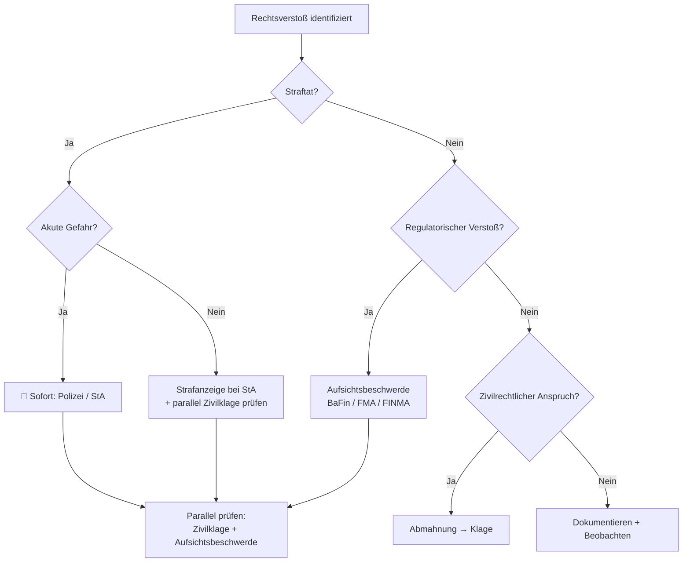

# Eskalationspfade — Wohin zuerst?

Definiert die Reihenfolge und Strategie für rechtliche Schritte. Der User muss wissen: Was zuerst, was parallel, was danach.

---

## Entscheidungsbaum: Eskalation

---

## Eskalationsstufen (Reihenfolge)

### Stufe 0: Dokumentieren + Beobachten
**Wann**: Verdacht besteht, aber Beweislage noch dünn (Bewertung C-D)
- Beweise sichern (Screenshots, Archive.org, Google Drive)
- Weitere Recherche durchführen
- Timeline dokumentieren
- **Kosten**: Keine
- **Dauer**: Tage bis Wochen

### Stufe 1: Abmahnung / Außergerichtliche Aufforderung
**Wann**: Klarer zivilrechtlicher Anspruch (Unterlassung, Schadensersatz)
- Anwaltliche Abmahnung mit Fristsetzung
- Unterlassungserklärung fordern
- **Kosten**: 500-3.000 € (Anwaltskosten, nach RVG)
- **Dauer**: 2-4 Wochen
- **Vorteil**: Schnell, kostengünstig, oft erfolgreich
- **Risiko**: Gegner ignoriert oder macht Gegenansprüche geltend

### Stufe 2: Aufsichtsbeschwerde
**Wann**: Regulatorischer Verstoß erkannt (fehlende Lizenz, fehlender Prospekt)
- **BaFin** (DE): Online-Formular oder schriftlich
- **FMA** (AT): Online-Meldeformular
- **FINMA** (CH): Online-Meldeformular
- **Kosten**: Keine (kostenlos)
- **Dauer**: Wochen bis Monate für Bearbeitung
- **Vorteil**: Behörde ermittelt mit eigenen Mitteln
- **Risiko**: Langsam, kein individueller Schadensersatz

### Stufe 3: Strafanzeige
**Wann**: Straftatbestand erfüllt (Bewertung A-B), Beweislage ausreichend
- Bei Polizei oder direkt bei Staatsanwaltschaft
- **Zuständig**: StA am Tatort oder Wohnsitz des Beschuldigten
- **Kosten**: Keine (kostenlos)
- **Dauer**: Monate bis Jahre
- **Vorteil**: Staat ermittelt, Durchsuchungsbefugnisse
- **Risiko**: Einstellung nach § 170 Abs. 2 StPO wenn Beweislage nicht reicht

### Stufe 4: Zivilklage
**Wann**: Bezifferbarer Schaden, zahlungsfähiger Gegner
- Klageschrift beim zuständigen Gericht
- **Kosten**: Abhängig vom Streitwert (siehe Kostenrechner unten)
- **Dauer**: 6-24 Monate (erste Instanz)
- **Vorteil**: Individueller Schadensersatz
- **Risiko**: Prozesskostenrisiko, Gegner insolvent

### Stufe 5: Einstweilige Verfügung / Eilantrag
**Wann**: Dringlichkeit (Beweise könnten vernichtet werden, Schaden droht)
- Beim Landgericht, ohne mündliche Verhandlung möglich
- **Kosten**: Wie Klage, aber geringerer Streitwert
- **Dauer**: Tage bis Wochen
- **Voraussetzung**: Dringlichkeit + Verfügungsanspruch

### Stufe 6: Musterfeststellungsklage / Sammelklage
**Wann**: Viele Geschädigte mit gleichem Problem
- Über Verbraucherzentralen oder qualifizierte Einrichtungen
- **Kosten**: Keine für Anmelder (nur Anmeldung zum Klageregister)
- **Dauer**: 1-3 Jahre
- **Vorteil**: Kein eigenes Kostenrisiko
- **Voraussetzung**: Mindestens 50 Betroffene im Register

---

## Wann NICHT handeln

| Situation | Warum abwarten | Stattdessen |
|-----------|---------------|-------------|
| Laufendes Ermittlungsverfahren | Eigene Aktionen könnten Ermittlung stören | Nur dokumentieren, Anwalt konsultieren |
| Beweislage noch dünn (C-D) | Klage/Anzeige würde scheitern | Weitere Recherche, Beweise sichern |
| Gegner ist insolvent | Urteil wertlos, Kosten bleiben | Aufsichtsbeschwerde statt Zivilklage |
| Eigene Beteiligung unklar | Strafanzeige könnte auf einen selbst zurückfallen | Anwalt konsultieren (Mandatsgeheimnis!) |
| Verjährung bereits eingetreten | Verfahren wird eingestellt | Dokumentieren für regulatorische Beschwerde |
| Gegner droht mit Gegenklage | Verleumdung, Kreditschädigung | Anwaltliche Beratung VOR jeder Aktion |

---

## Mediation & Schlichtung (Alternative)

Vor Eskalation IMMER prüfen ob außergerichtliche Lösung möglich:

| Verfahren | Wann geeignet | Kosten | Dauer |
|-----------|--------------|--------|-------|
| **Direkte Verhandlung** | Gegner ist gesprächsbereit | Keine | Tage |
| **Mediation** | Beide Seiten wollen Lösung | 150-300 €/h | Wochen |
| **Schlichtung** (IHK, Verbraucherzentrale) | Verbraucherstreit | Gering/kostenlos | Wochen |
| **Ombudsmann** (Banken, Versicherungen) | Finanzdienstleistungsstreit | Kostenlos | 1-3 Monate |

---

## Whistleblower-Schutz (HinSchG)

Seit Juli 2023: Hinweisgeberschutzgesetz schützt Melder vor Repressalien.

| Aspekt | Details |
|--------|---------|
| **Wer ist geschützt** | Arbeitnehmer, Beamte, Selbstständige, Praktikanten, Anteilseigner |
| **Interne Meldestelle** | Unternehmen ab 50 MA müssen einrichten |
| **Externe Meldestelle** | BaFin, Bundeskartellamt, Bundesamt für Justiz |
| **Schutz** | Verbot von Kündigung, Abmahnung, Versetzung als Vergeltung |
| **Beweislastumkehr** | Arbeitgeber muss beweisen, dass Maßnahme NICHT Vergeltung war |
| **Schadensersatz** | Bei Verstoß gegen Repressalienverbot |

---

## Kostenrechner (Zivilklage, grob)

| Streitwert | Gerichtskosten (3 Gebühren) | Anwalt Kläger (RVG) | Anwalt Beklagter | Gesamt bei Verlust |
|-----------|---------------------------|--------------------|--------------------|-------------------|
| 5.000 € | 438 € | 925 € | 925 € | ~2.288 € |
| 10.000 € | 723 € | 1.242 € | 1.242 € | ~3.207 € |
| 25.000 € | 1.218 € | 2.151 € | 2.151 € | ~5.520 € |
| 50.000 € | 1.818 € | 3.079 € | 3.079 € | ~7.976 € |
| 100.000 € | 3.078 € | 4.622 € | 4.622 € | ~12.322 € |

**Rechtsschutzversicherung**: Prüfen ob Rechtsgebiet abgedeckt (oft: kein Kapitalanlagerecht!)
**Prozesskostenhilfe**: Bei geringem Einkommen, Erfolgsaussicht muss bestehen

---

## Insolvenzrisiko-Check der Gegenseite

VOR Zivilklage IMMER prüfen:

1. **Handelsregister**: Stammkapital, Jahresabschlüsse veröffentlicht?
2. **Bundesanzeiger**: Letzte Bilanz → Eigenkapital positiv?
3. **Insolvenzbekanntmachungen**: insolvenzbekanntmachungen.de prüfen
4. **Wirtschaftsauskunftei**: Creditreform, CRIF wenn möglich
5. **Offshore-Struktur?**: UK Ltd, Liechtenstein AG → Vollstreckung im Ausland schwierig

| Ergebnis | Empfehlung |
|----------|-----------|
| Eigenkapital positiv, Firma operativ | Zivilklage sinnvoll |
| Stammkapital minimal, keine Bilanz veröffentlicht | ⚠️ Vollstreckungsrisiko hoch |
| Insolvenzverfahren läuft | ❌ Zivilklage sinnlos, Forderung anmelden |
| Offshore, kein Vermögen in DE/EU | ❌ Vollstreckung praktisch unmöglich |
