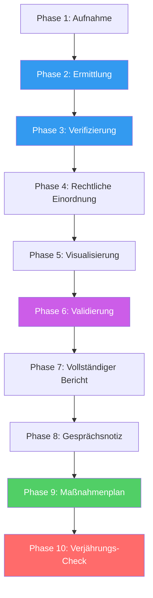

# Kernlogik — Systematischer Analyse-Durchlauf

Definiert die einheitliche Ablauflogik für ALLE Analysen (Recht, Steuer, Strategie). Stellt sicher, dass kein Schritt übersprungen wird und am Ende IMMER zwei Outputs entstehen.

---

## Grundprinzip: Zwei Outputs

Jede Analyse produziert ZWEI Dokumente:

| Output | Zweck | Speicherort | Zielgruppe |
|--------|-------|-------------|-----------|
| **Vollständiger Bericht** | Alle Funde, Quellen, Bewertungen, Beweismittel | `docs/analysen/` | Akten, Dokumentation |
| **Gesprächsnotiz** | Kompakte Version für Fachmann-Gespräch | `docs/analysen/` (Suffix `-notiz`) | Anwalt, Steuerberater, Berater |

Namensschema:
- Bericht: `YYYY-MM-DD-<thema>-analyse.md`
- Notiz: `YYYY-MM-DD-<thema>-notiz.md`

---

## Systematischer Durchlauf (10 Phasen)

Jede Phase MUSS durchlaufen werden. Phasen dürfen NICHT übersprungen werden.
Bei einfachen Analysen (Subagent) werden Phasen 2-3 verkürzt aber nicht ausgelassen.



---

### Phase 1: Aufnahme

**Was**: Sachverhalt verstehen, Akteure identifizieren, Komplexität bestimmen.

- [ ] Jurisdiktion(en) bestimmen
- [ ] Rechtsgebiet(e) bestimmen
- [ ] Alle Akteure identifizieren (Personen, Firmen, Marken, Plattformen)
- [ ] User-Unterlagen entgegennehmen (PDFs, Screenshots, Links)
- [ ] Komplexitäts-Erkennung: EINFACH oder KOMPLEX?
- [ ] Bei KOMPLEX: Agent Team aktivieren

**Output Phase 1**: Akteursliste + Sachverhaltsskizze

---

### Phase 2: Ermittlung

**Was**: Eigenständige Recherche — NICHT nur User-Unterlagen verwenden.

- [ ] Regulatorische Warnungen prüfen (BaFin, FMA, FINMA, ESMA, SEC, IOSCO)
- [ ] Handelsregister für JEDE Firma (Gründung, GF, Gesellschafter, Kapital)
- [ ] Digitaler Fußabdruck für JEDEN Akteur (YouTube, Telegram, Facebook, Instagram, X, LinkedIn, Reddit)
- [ ] Presserecherche (Google News, Medienberichte)
- [ ] Archive.org für historische Website-Versionen
- [ ] Netzwerk-Analyse (verknüpfte Firmen über gleiche GF/Gesellschafter)
- [ ] Beweismittel sichern (Volltext, URL, Zeitstempel)

**Output Phase 2**: Recherche-Dossier in `docs/recherchen/`

---

### Phase 3: Verifizierung

**Was**: User-Unterlagen gegen eigene Funde abgleichen.

- [ ] Jede Behauptung des Users gegen öffentliche Quellen prüfen
- [ ] Red-Flag-Detektor: Außendarstellung vs. Handelsregister-Realität
- [ ] Bei Widersprüchen: BEIDE Versionen dokumentieren
- [ ] Vollständigkeits-Check: "Was fehlt noch im Bild?"

**Output Phase 3**: Verifizierungs-Tabelle (Behauptung → Quelle → Status)

---

### Phase 4: Rechtliche Einordnung

**Was**: Funde rechtlich bewerten — je nach Domäne.

**Recht:**
- [ ] Tatbestände identifizieren (StGB, Nebengesetze)
- [ ] Tatbestandsmerkmale prüfen (objektiv + subjektiv)
- [ ] Verjährung prüfen
- [ ] Zivilrechtliche Ansprüche prüfen
- [ ] Regulatorische Verstöße identifizieren

**Steuern:**
- [ ] Steuerliche Struktur analysieren
- [ ] Steuerhinterziehungs-Tatbestand prüfen (§ 370 AO)
- [ ] Internationale Aspekte (DBA, Hinzurechnungsbesteuerung)
- [ ] Meldepflichten prüfen (DAC6, CRS)

**Strategie:**
- [ ] Framework-Analyse durchführen (SWOT/Porter/PESTEL)
- [ ] Risiken identifizieren
- [ ] Handlungsempfehlungen entwickeln
- [ ] Rechtliche/steuerliche Querverweise setzen

**Output Phase 4**: Befunde-Tabelle mit A-E Bewertung

---

### Phase 5: Visualisierung

**Was**: Zusammenhänge visuell darstellen. Lies `references/visualisierung.md`.

- [ ] Akteurs-Netzwerk erstellen (Mermaid graph)
- [ ] Bei Steuern: Geldfluss-Diagramm erstellen
- [ ] Bei Strategie: Marktposition-Mindmap erstellen
- [ ] Bei strafrechtlicher Relevanz: Beweisketten-Diagramm
- [ ] Farbcodierung einheitlich anwenden
- [ ] Max. 15 Knoten pro Diagramm

**Output Phase 5**: 1-3 Mermaid-Diagramme

---

### Phase 6: Validierung

**Was**: Qualitätssicherung der gesamten Analyse.

- [ ] Confidence-Score berechnen (lies `references/confidence-scoring.md`)
- [ ] Jeden Befund einzeln mit A-E bewerten
- [ ] Bei Score < 70: Devil's Advocate aktivieren
- [ ] Disclaimer bestimmen (lies `references/disclaimer-system.md`)
- [ ] Bewertungs-Legende in Dokument einfügen
- [ ] Quellen-Liste vollständig?

**Output Phase 6**: Confidence-Score + Befund-Bewertungen

---

### Phase 7: Vollständiger Bericht

**Was**: Alles zusammenführen in einem strukturierten Dokument.

Dokumentstruktur:

```markdown
---
titel: [Kurztitel]
datum: YYYY-MM-DD
typ: analyse | gutachten | report
skill: recht-recherche | steuer-analyse | beratung-strategie
jurisdiktion: [Jurisdiktionen]
confidence: [0-100]
---

# [Titel]

## Netzwerk-Übersicht
[Mermaid-Diagramm — Gesamtbild ZUERST]

## Sachverhalt
[Zusammenfassung]

## Identifizierte Akteure
[Tabelle]

## Ermittlungsergebnisse
### Regulatorische Warnungen
[Tabelle]
### Unternehmens-Verifizierung
[Tabelle mit Red Flags]
### Digitaler Fußabdruck
[Tabelle]

## Rechtliche Würdigung / Steuerliche Analyse / Strategische Bewertung
[Befunde mit A-E Bewertung]
[Ggf. Beweisketten-Diagramm]

## Empfohlene Maßnahmen
[Priorisierte Liste mit Fristen]

## Bewertungs-Legende
[A-E Tabelle]

## Confidence: [XX]% ([Label])
Basiert auf [N] Quellen: [Quellenliste]

---
[Disclaimer]
---
```

**Speichern in**: `${CLAUDE_PLUGIN_ROOT}/docs/analysen/YYYY-MM-DD-<thema>-analyse.md`

---

### Phase 8: Gesprächsnotiz

**Was**: Kompakte Version für das Gespräch mit dem Fachmann erstellen.

Verwende `templates/gespraechsnotiz.md` als Vorlage.

Kern-Elemente:
- [ ] Sachverhalt in 3-5 Sätzen
- [ ] Top 5 Findings mit A-E Bewertung
- [ ] Kompaktes Netzwerk-Diagramm (max. 10 Knoten)
- [ ] 5 konkrete Fragen an den Fachmann
- [ ] Mitzubringende Unterlagen mit Verfügbarkeits-Status
- [ ] Fristen und Dringlichkeit
- [ ] Verweis auf vollständigen Bericht

**Speichern in**: `${CLAUDE_PLUGIN_ROOT}/docs/analysen/YYYY-MM-DD-<thema>-notiz.md`

---

### Phase 9: Maßnahmenplan (PFLICHT)

**Was**: Konkrete, priorisierte Handlungsempfehlungen mit Zuständigkeit, Fristen und Hilfsmitteln.

Lies `references/massnahmenplan.md` für die Basis-Logik.
Für eigenständige Umsetzungspläne (Standalone oder nach Analyse): Lies `references/umsetzungsplan.md`.
Verwende `templates/umsetzungsplan-template.md` als Template.
Aktiviere `agents/umsetzungsplaner.md` für die Erstellung.

- [ ] Sofort-Maßnahmen (< 7 Tage) — Beweissicherung, akute Fristen
- [ ] Kurzfristige Maßnahmen (< 30 Tage) — Anwalt beauftragen, Aufsichtsbeschwerde
- [ ] Mittelfristige Maßnahmen (< 90 Tage) — Zivilklage, Compliance-Aufbau
- [ ] Laufende Maßnahmen — Monitoring, wiederkehrende Prüfungen
- [ ] Schadensbegrenzung: Zahlungen stoppen, Widerruf, Chargeback
- [ ] Selbstanzeige-Option prüfen (bei steuerlicher Betroffenheit des Users)
- [ ] Kollektive Lösungen: Musterfeststellungsklage, Verbraucherzentrale
- [ ] Eskalationspfad: Lies `references/eskalationspfade.md`
- [ ] Insolvenzrisiko der Gegenseite prüfen (VOR Zivilklage)
- [ ] Reihenfolge-Diagramm (Mermaid: Was muss VOR was passieren?)

**Jede Maßnahme MUSS enthalten**: Was genau tun, Warum, Wer ist zuständig, Bis wann, Womit (konkrete Links, Anwalts-Spezialisierung, Behörden-URLs).

**Speichern**: Maßnahmenplan ist Teil des Berichts UND der Gesprächsnotiz.

---

### Phase 10: Verjährungs-Check (PFLICHT bei rechtlicher Relevanz)

**Was**: Für JEDEN identifizierten Tatbestand/Anspruch die Verjährungsfrist berechnen.

Lies `references/verjährungsfristen.md` für alle Fristen und Berechnungsregeln.

- [ ] Jeden Tatbestand mit Verjährungs-Zeile versehen
- [ ] Tatzeit schätzen (auch wenn nur ungefähr)
- [ ] Deadline berechnen (Tatzeit + Frist)
- [ ] Status farbcodieren: 🟢 > 2 Jahre, 🟡 < 1 Jahr, 🔴 < 3 Monate oder verjährt
- [ ] Hemmungsgründe prüfen (Verhandlungen, Mahnbescheid)
- [ ] **Nächste kritische Frist prominent hervorheben**
- [ ] Bei Steuerdelikten: Festsetzungsverjährung UND Strafverfolgungsverjährung getrennt prüfen

```markdown
### Verjährungs-Übersicht

| Tatbestand | Norm | Tatzeit | Frist | Deadline | Status |
|-----------|------|---------|-------|----------|--------|

⏰ **Nächste kritische Frist**: [Datum] — [Was bis dahin passieren muss]
```

**Speichern**: Verjährungs-Übersicht ist Teil des Berichts UND der Gesprächsnotiz.

---

## Phasen-Tiefe nach Modus

| Phase | Subagent (EINFACH) | Agent Team (KOMPLEX) |
|-------|-------------------|---------------------|
| 1. Aufnahme | Vollständig | Vollständig |
| 2. Ermittlung | Gekürzt (Warnungen + Handelsregister) | Vollständig (OSINT komplett) |
| 3. Verifizierung | Basis-Check | Vollständig |
| 4. Einordnung | Ein Rechtsgebiet | Alle relevanten Gebiete |
| 5. Visualisierung | Optional (1 Diagramm) | Pflicht (2-3 Diagramme) |
| 6. Validierung | Vollständig | Vollständig + DA/BSA |
| 7. Bericht | Standard | Umfassend |
| 8. Gesprächsnotiz | Optional | Pflicht |
| 9. Maßnahmenplan | Kurzversion (Top 3) | Vollständig (alle Stufen) |
| 10. Verjährungs-Check | Bei Bedarf | Pflicht |
