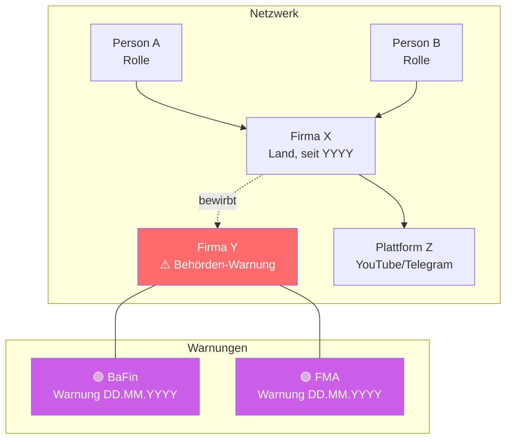
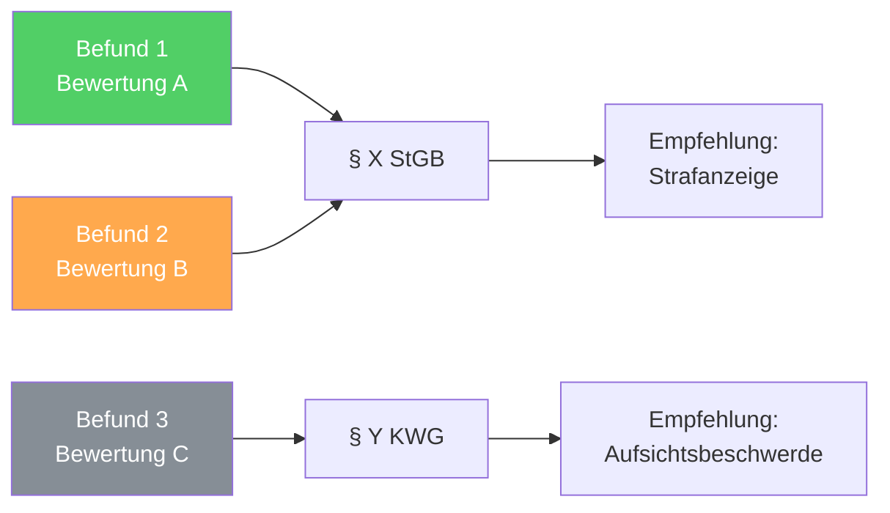
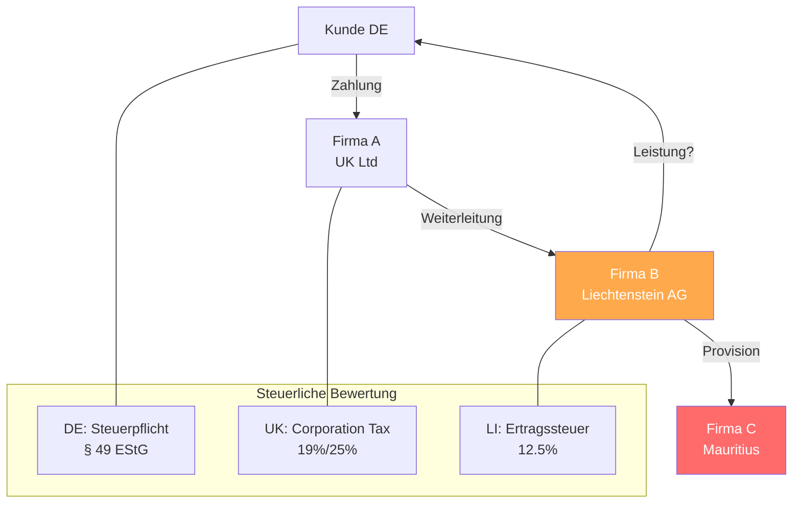
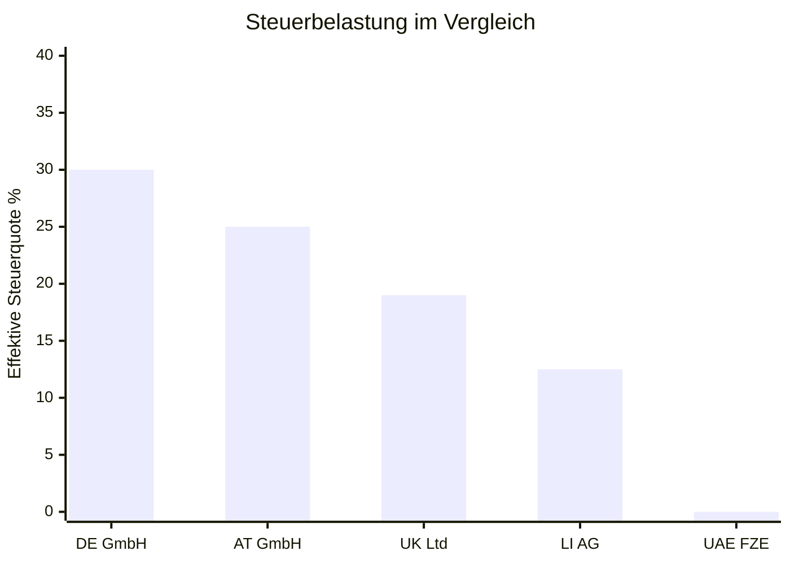
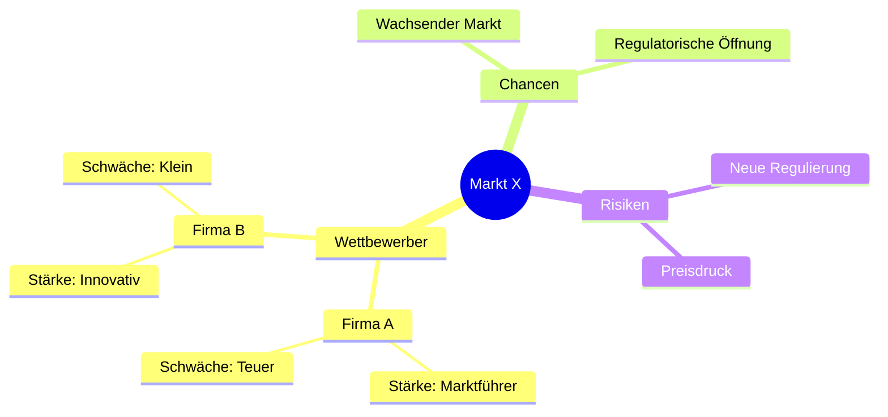
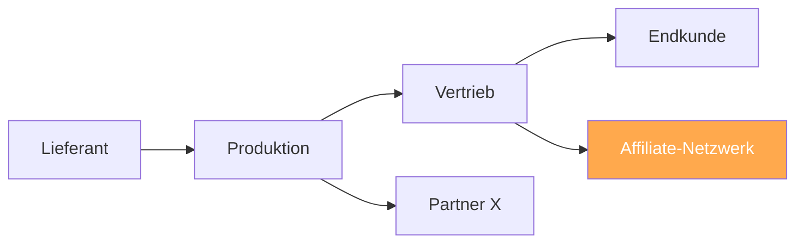

# Visualisierung — Mermaid-Diagramme

Jede komplexe Analyse enthält PFLICHT-Diagramme zur Darstellung von Zusammenhängen. Einfache Analysen (Subagent-Modus) erhalten Diagramme nur wenn sinnvoll.

---

## Grundregeln

1. **Mermaid-Syntax** verwenden — rendert in GitHub, VS Code, Obsidian, Notion
2. **Maximal 15 Knoten** pro Diagramm — darüber hinaus aufteilen
3. **Farbcodierung** einheitlich (siehe unten)
4. **Warnungen rot markieren** — sofort visuell erkennbar
5. **Diagramm VOR dem Fließtext** platzieren — Leser erfasst Gesamtbild zuerst

---

## Farbcodierung (einheitlich über alle Domänen)

```
🔴 Rot (#ff6b6b)     — Warnungen, Red Flags, Straftatbestände
🟠 Orange (#ffa94d)   — Offshore/Ausland, Risiken, Prüfungsbedarf
🟢 Grün (#51cf66)     — Unbedenklich, belegt, konform
🔵 Blau (#339af0)     — Neutrale Akteure, Informationsquellen
🟣 Lila (#cc5de8)     — Behörden, Regulatoren
⚪ Grau (#868e96)     — Noch nicht geprüft, offen
```

In Mermaid:
```
style NODE fill:#ff6b6b,color:#fff   %% Rot — Warnung
style NODE fill:#ffa94d,color:#fff   %% Orange — Risiko
style NODE fill:#51cf66,color:#fff   %% Grün — OK
style NODE fill:#339af0,color:#fff   %% Blau — Neutral
style NODE fill:#cc5de8,color:#fff   %% Lila — Behörde
style NODE fill:#868e96,color:#fff   %% Grau — Offen
```

---

## Diagramm-Typen pro Domäne

### Recht: Akteurs-Netzwerk

Zeigt Personen, Firmen, Plattformen und deren Verbindungen. Warnungen sofort sichtbar.



**Wann verwenden:** Immer wenn >= 2 Akteure oder Firmen beteiligt sind.

### Recht: Beweiskette

Zeigt den Zusammenhang zwischen Befunden und deren Beweislage.



**Wann verwenden:** Bei strafrechtlicher Relevanz oder wenn mehrere Tatbestände geprüft werden.

---

### Steuern: Geldfluss-Diagramm

Zeigt Firmenstrukturen, Geldflüsse und steuerliche Zuordnung.



**Wann verwenden:** Bei internationalen Strukturen, Holding-Konstrukten, Verdacht auf Gewinnverschiebung.

### Steuern: Steuerbelastungs-Vergleich

Einfaches Balken-Diagramm für Steuervergleiche (Mermaid xychart).



**Wann verwenden:** Bei DBA-Analysen, Standortvergleichen, Holding-Optimierung.

---

### Strategie: Marktposition / Wettbewerber



**Wann verwenden:** Bei Marktanalysen, SWOT, Wettbewerbsanalysen.

### Strategie: Wertschöpfungskette



**Wann verwenden:** Bei Business Model Analyse, Due Diligence, Geschäftsmodell-Prüfung.

---

## Platzierung im Dokument

```
## Ermittlungsbericht / Analyse

### Netzwerk-Übersicht          ← DIAGRAMM HIER (Gesamtbild zuerst)
[Mermaid-Diagramm]

### Identifizierte Akteure      ← Dann Details
[Tabelle]

### Befunde                     ← Ggf. Beweisketten-Diagramm
[Tabelle mit A-E Bewertung]

...

### Gesprächsnotiz              ← Am Ende
[Kompakte Version]
```

---

## Regeln für Agenten

1. **Ermittler-Agent**: Erstellt Akteurs-Netzwerk nach Phase 2 (Unternehmens-Verifizierung)
2. **Ankläger-Agent**: Erstellt Beweiskette nach Phase 3 (Tatbestandsprüfung)
3. **Steuerfahnder-Agent**: Erstellt Geldfluss-Diagramm nach Phase 1 (Struktur-Analyse)
4. **Stratege/Marktanalyst**: Erstellt Marktposition-Mindmap nach Framework-Analyse
5. **Lead**: Konsolidiert alle Diagramme im Endbericht, prüft auf Konsistenz
