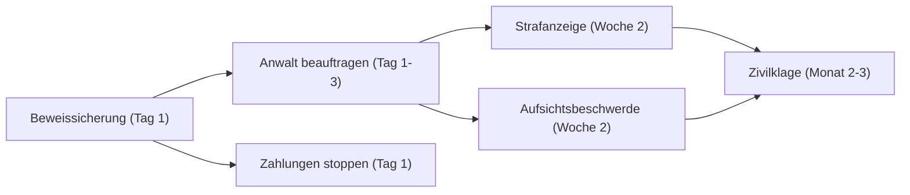

# Umsetzungsplan: [Kurztitel]

## Zusammenfassung

[Max. 5 Sätze: Ausgangslage → Top-Risiko → dringendste Frist → empfohlene erste Aktion]

⏰ **Nächste kritische Frist**: [Datum] — [Was bis dahin passieren muss]
📊 **Basis-Konfidenz**: [Score] ([Label]) — basiert auf [N] Quellen

---

## Bereits erledigt

| # | Maßnahme | Erledigt am | Ergebnis |
|---|---------|------------|---------|
| [nur wenn User Angaben gemacht hat] |

---

## Abhängigkeits-Sequenz

---

## 🔴 Sofort-Maßnahmen (0–7 Tage)

| # | Was | Warum | Wer | Bis wann | Womit | Kosten | Erfolgskriterium |
|---|-----|-------|-----|----------|-------|--------|-----------------|
| S1 | [Konkrete Handlung im Imperativ] | [1-Satz Begründung] | [User/Anwalt/Behörde] | [Datum] | [Link/Ressource] | [€] | [Messbares Ergebnis] |

**Status-Übersicht Sofort:**
| # | Status |
|---|--------|
| S1 | ✗ Nicht begonnen |

---

## 🟡 Kurzfristige Maßnahmen (8–30 Tage)

| # | Was | Warum | Wer | Bis wann | Womit | Kosten | Erfolgskriterium |
|---|-----|-------|-----|----------|-------|--------|-----------------|
| K1 | | | | | | | |

**Status-Übersicht Kurzfristig:**
| # | Status |
|---|--------|
| K1 | ✗ Nicht begonnen |

---

## 🟢 Mittelfristige Maßnahmen (31–90 Tage)

| # | Was | Warum | Wer | Bis wann | Womit | Kosten | Erfolgskriterium |
|---|-----|-------|-----|----------|-------|--------|-----------------|
| M1 | | | | | | | |

---

## 🔵 Laufende Maßnahmen (regelmäßig)

| # | Was | Intervall | Wer | Womit |
|---|-----|-----------|-----|-------|
| L1 | [Monitoring-Aufgabe] | [Monatlich/Quartalsweise] | | |

---

## ⚡ Konflikt-Auflösungen

[Nur ausfüllen wenn Empfehlungen aus verschiedenen Domänen widersprüchlich sind]

| Konflikt | Option A | Option B | Empfehlung | Begründung |
|---------|---------|---------|-----------|-----------|

---

## 💡 Ressourcen-Hinweise

| Maßnahme | Grundsätzlich | Wo Kosteninformation holen |
|---------|--------------|--------------------------|
| [Kostenfreie Schritte] | Kostenfrei | — |
| [Kostenpflichtige Schritte] | Kostenpflichtig | Erstgespräch mit [Anwalt-Typ] / [Behörde] |
| Rechtsschutzversicherung | Prüfen | Eigene Police, Stichwort: [Rechtsgebiet] |
| Prozesskostenhilfe | Prüfen wenn nötig | Antrag beim zuständigen Gericht |

---

## 🔬 Devil's Advocate Check

[Wurde dieser Plan durch devils-advocate.md geprüft?]

- **Hauptgegenargument**: [Was spricht gegen den empfohlenen Weg?]
- **Blind Spots**: [Was könnte übersehen worden sein?]
- **Gray Areas**: [Wo ist Unsicherheit am größten?]
- **Plan-Konfidenz**: [Wie sicher ist dieser Plan?] [0-100]%

---

*Erstellt: [Datum] | Plugin: beratungs-suite-pro | Perspektive: [gewählte Perspektive] | Basis: [Analyse-Datei]*
*[Disclaimer aus references/disclaimer-system.md]*
